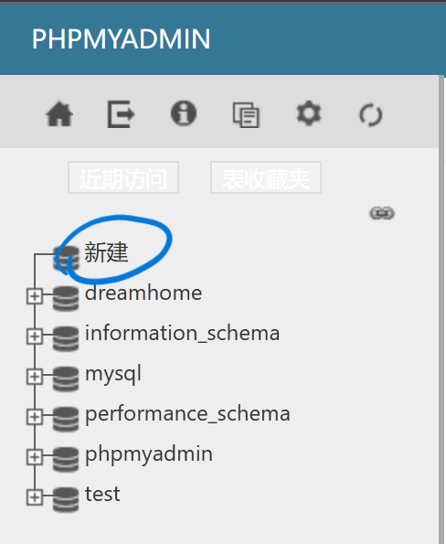

# MySQL

## Creating SQL

我的理解是有两种方式：

- 终端创建
- 借助XAMPP提供工具创建

### 终端创建

如何在XAMPP打开终端？

1. 以管理员身份运行XAMPP
2. 于Action处启动Apache和MySQL
3. 点击右侧的Shell打开终端


### 借助XAMPP提供工具创建

数据库创建步骤如下：

1. 于Action处启动Apache和MySQL

2. 点击MySQL的Admin，打开工具网页


3. 左侧工具栏“新建”以创建新的数据库



4. 命名数据库然后点击创建


5. 新建数据表存储数据（此处字段数为表头属性数量）


6. 设置表头属性（**注意设置数据类型以及数据长度**），点击保存

  （varchar:可变长度字符类型）


7. 插入属性数据（如需要增加表头属性，可以在下方添加）


8. 设置属性数据（右侧空值处输入），可以选择一行一行执行，亦可以在最下方全部执行。


9. 完成创建表，可在浏览处查看


于终端查看数据库：

1. 打开终端，输入命令：

	```
	mysql -u root -p
	```

2. 输入密码进入数据库

	

3. 进入目标数据库

	```
	use 数据库名称;
	```
	
	

4. 打开表

	```
	SELECT * FROM 表名;
	```


## SQL basics

### SQL - Structured Query Language

结构化查询语言

SQL is a declarative language.

SQL是一种**声明性**语言。

SQL is an abstract & portable interface to RDBMSs.

SQL是一个抽象的、可移植的RDBMS接口（RDBMS：关系数据库管理系统）。

### Common command

- 使用数据库

	```
	musql -u root -p
	```

- 查看数据库实例中有多少数据库

	```
	show databases
	```

- 选择使用test数据库

	```
	use test
	```

- 查看数据库中有多少用户表

	```
	show tables
	```

- 查看表的结构

	```
	show 表名
	```

### SQL Syntax

SQL句法

```sql
CREATE TABLE Staff(StaffNo INTEGER, Salary FLOAT, Lname                      VARCHAR(20));
INSERT INTO Staff VALUES (32, 25000.0, 'Smith');
```

- SQL使用英文关键字和用户定义的名称
- 关键字用大写
- 文本数据使用单引号括起来
- 圆括号用于对相关项进行分组
- 逗号用于分隔列表中的项目
- 语句以分号结束

### SELECT

SELECT用于检索和格式化数据。

```sql
SELECT target-list
FROM relation-list
WHERE qualification;
```

relation-list：关系名列表

target-list：list中的关系属性列表

qualification：限定条件

其中有需要用到的比较符：

- < ,  > , = ,  ̸= ,  ≤  , ≥
- AND , OR and NOT

## Query Properties

询问性质

### Selecting Specific Columns

可以通过给出**列的名称**来输出特定的列

```sql
+------+--------+------+------+   Staff
|Lname |Position|Salary|sex   |
+------+--------+------+------+
|Jones |Manager |20000 |male  |
|Smith |Assis   |15000 |female|
|Tom   |Director|40000 |male  |
+------+--------+------+------+

SELECT Lname, Position, Salary FROM Staff;

+------+--------+------+
|Lname |Position|Salary|
+------+--------+------+
|Jones |Manager |20000 |
|Smith |Assis   |15000 |
|Tom   |Director|40000 |
+------+--------+------+
```

如上图例子：用SELECT将Lname、Position和Salary三列从原表中提取出来

列名与列名之间需要用逗号, 来分隔

### Selecting Specific Rows & Columns

获取特定的行和列

```sql
+------+--------+------+------+   Staff
|Lname |Position|Salary|sex   |
+------+--------+------+------+
|Jones |Manager |20000 |male  |
|Smith |Assis   |15000 |female|
|Tom   |Director|40000 |male  |
+------+--------+------+------+

SELECT Lname, Position, Salary
FROM Staff
WHERE Salary > 20000;

+------+--------+------+
|Lname |Position|Salary|
+------+--------+------+
|Tom   |Director|40000 |
+------+--------+------+
```

此处的语句意思是：从Staff中，获取工资大于20000的Lname、Salary和Salary

### Predicates

谓词

- 谓词求值为true或false
- 谓词可以使用AND, OR和NOT组合
- 使用括号避免歧义
- Predicates can be combined using **AND , OR , NOT, BETWEEN , IN , and LIKE**

```sql
SELECT * FROM Staff WHERE
(Position = 'Manager') OR
(Position = 'Assistant' AND Salary > 10000);

SELECT * FROM Staff WHERE
(Position = 'Manager' OR Position = 'Assistant')
AND NOT (Salary <= 10000);
```

（上例代码二者并不相同）

```sql
SELECT * FROM Staff
WHERE
(Salary BETWEEN 10000 AND 20000) AND
(Position IN ('Manager', 'Assistant')) AND
(Lname LIKE 'S%' OR Lname LIKE 'W____');
```

**% matches zero or more characters 代替零个或多个字符**

**__ matches exactly one character 代替一个字符**

例：

```sql
+------+--------+------+------+   Staff
|Lname |Position|Salary|sex   |
+------+--------+------+------+
|Jones |Manager |20000 |male  |
|Smith |Assis   |15000 |female|
|Tom   |Director|40000 |male  |
+------+--------+------+------+

SELECT * FROM STAFF
WHERE Lname LIKE "_m%"

+------+--------+------+------+ 
|Lname |Position|Salary|sex   |
+------+--------+------+------+
|Smith |Assis   |15000 |female|
+------+--------+------+------+
```

## SQL Sublanguage

There are three main categories:

- Data Definition Language (DDL) for creating a DB

	e.g., CREATE , DROP , ALTER

- Data Control Language (DCL) for administering a DB

	e.g., GRANT , DENY , USE

- Data Manipulation Language (DML) to access a DB

	e.g., SELECT , INSERT , UPDATE , DELETE


## SQL Formatting Results

### DISTINCT

去重操作


Query1:

```sql
SELECT propertyNo FROM Viewing;
```

Query2:

```sql
SELECT DISTINCT propertyNo FROM Viewing;
```


DISTINCT的作用是**去重**

### ORDER BY

用于升序降序排列


 Query1:

```mysql
SELECT staffNo, fName, lName, salary
FROM Staff
ORDER BY salary DESC;
```

从Staff表中取staffNo, fNmae, lName 和salary, 降序排列

 Query2:

```mysql
SELECT staffNo, fName, lName, salary
FROM Staff
ORDER BY 4 ASC;
```

从Staff表中取staffNo, fNmae, lName 和salary, 升序排列

### Calculated Fields

计算字段

用于做简单的数据库计算

```mysql
SELECT staffNo, fName, lName, salary/12
FROM Staff;
```

从Staff表中取staffNo, fNmae, lName 和salary, 其中salary除以12


### Renaming Columns

重命名列

利用AS来实现重命名：

```mysql
SELECT staffNo, fName, lName, salary/12 AS monthlySalary
FROM Staff;
```

此处把salary重命名为monthlySalary


## Aggregate Functions

统计函数

- SUM
- AVG
- MIN
- MAX
- COUNT

### SUM, MIN, MAX, AVG


```mysql
SELECT MIN(salary) AS myMin,
MAX(salary) AS myMax,
AVG(salary) AS myAvg,
SUM(salary) AS mySum
FROM Staff;
```


MIN:取最小

MAX：取最大

AVG：取平均

SUM：求和

此处还用到了AS以重命名列

### COUNT

计算行数（包括有重复项和空值的行）


```mysql
SELECT Count(*) as WomenStaff
FROM Staff
WHERE Sex='F';
```

从Staff表中取Sex为F的**所有**（*）行，并且重命名为WomenStaff

### GROUP BY

分组


```mysql
SELECT branchNo,
Count(staffNo) AS myCount,
SUM(salary) AS mySum
FROM Staff
GROUP BY branchNo;
```

### HAVING

取值：取一定范围的数据


```mysql
SELECT branchNo,
Count(staffNo) AS myCount,
SUM(salary) AS mySum
FROM Staff
GROUP BY branchNo
HAVING COUNT(staffNo)>1;
```

Having一行的意思是：只取COUNT(staffNo)大于1的行

## Data Manipulation Language Command

### INSERT

插入数据于表中

基本格式：

```mysql
INSERT INTO
TableName
(colname1, colname2, ...)
VALUES (value1, value2, ...);
```

例：

```mysql
INSERT INTO 
Staff
(StaffNo, Salary, Position, Lname)
VALUES (322, 15000, 'Assistant', 'Smith');
```


### Modifying & Deleting Data

- UPDATE

	例：

	```mysql
	UPDATE Staff SET Salary = 1.05 * Salary
	WHERE Position = 'Director';
	```

- DELETE

	例：

	删除表中特定的行

	```mysql
	DELETE FROM Staff WHERE Fname IS NULL;
	```

	删除所有行数据（清空表中数据）

	```mysql
	DELETE FROM Staff;
	```

- DROP

	例：

	完全删除表

	```mysql
	DROP TABLE Staff;
	```

### NULL

NULL在表中广泛使用，两种形式：

- IS NULL
- IS NOT NULL

例：

```mysql
SELECT * FROM Staff WHERE Fname IS NULL;
```

## Merhing Result

合并结果

### Set Operation

基本格式：

```mysql
(SELECT ...) UNION (SELECT ...)

(SELECT ...) INTERSECT (SELECT ...)

(SELECT ...) EXCEPT (SELECT ...)
```

#### UNION

OR

#### INTERSECT

交叉，相交：同时拥有

```mysql
(SELECT City FROM Branch) INTERSECT
(SELECT City FROM PropertyForRent);
```


两表同时拥有城市：London和Glasgow（两表相交部分）

#### EXCEPT

除了，无交集

### Subqueries

子查询

#### Nested SELECTs

嵌套SELECT

例：

```mysql
SELECT * FROM Staff WHERE
Salary > (SELECT Salary FROM Staff WHERE Lname ='Smith');
```

##  Querying Multiple Tables


### Property Query1

信息查询1

```mysql
SELECT PropertyNo
FROM Viewing
WHERE ClientNo = 'CR56';
```

语句翻译：从Viewing中取ClientNo为 “CR56”的PropertyNo

结果如下：


### Property Query2

信息查询2

```mysql
SELECT Viewing.PropertyNo, Street, City, ViewDate
FROM Viewing, PropertyForRent
WHERE ClientNo = 'CR56'
AND Viewing.PropertyNo = PropertyForRent.PropertyNo;
```

此处增加了限定条件：AND

注意表示表中列的方法，语法：

```
表名.表头（列）

例：Viewing.PropertyNo
```

语句结果：


### Using Table Aliases

使用表别名

```mysql
SELECT C.Fname, C.Lname, P.Street, P.City, V.ViewDate
FROM Viewing V, PropertyForRent P, Client C
WHERE C.Fname = 'Aline' AND C.Lname = 'Stewart'
AND V.PropertyNo = P.PropertyNo
AND V.ClientNo = C.ClientNo;
```

此处使用了表别名，为了方便和简化表达

C：Client

P：PropertyForRent

V：Viewing

## Joint Types

联合型

### Theta join

a join using a simple **WHERE** predicate

### Equi join

相等连接

a special case of theta join (= predicate)

### Natrual join

自然连接

special case of equi join (match keys)

### Semi join

theta join that outputs from just one table

### Self join

joining a table to itself

### Outer join

外部连接

Cartesian products (no predicates)

### Cross join

交叉连接

Cartesian products (no predicates)


