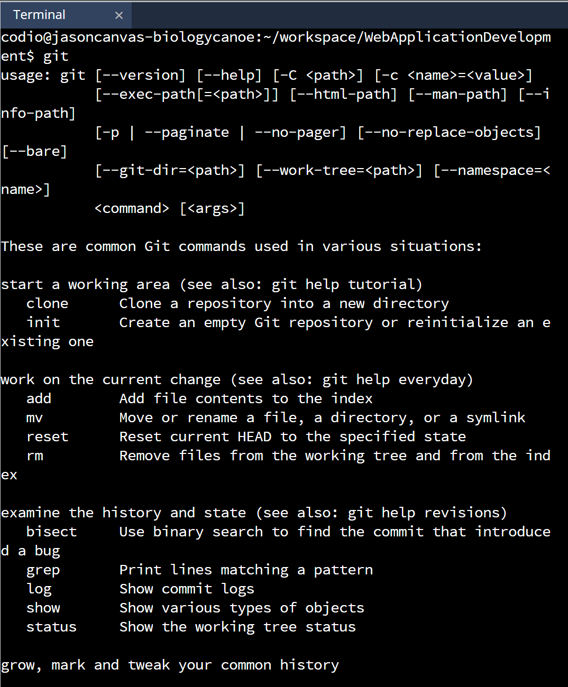
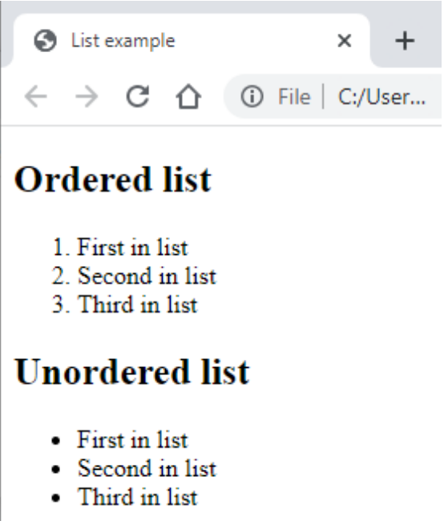
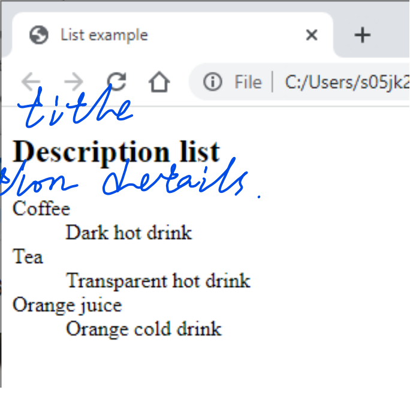
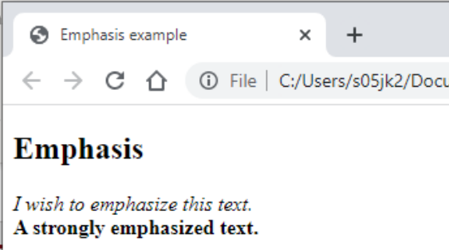
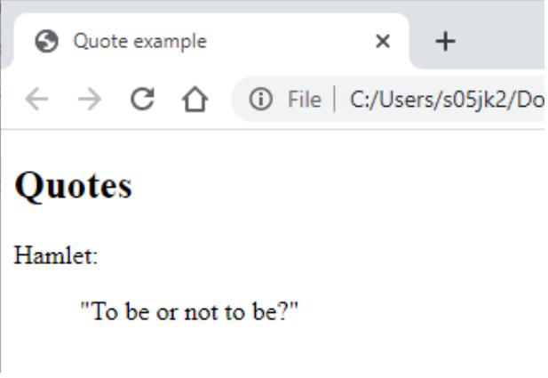
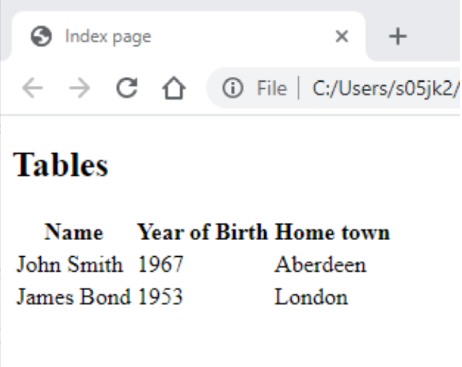
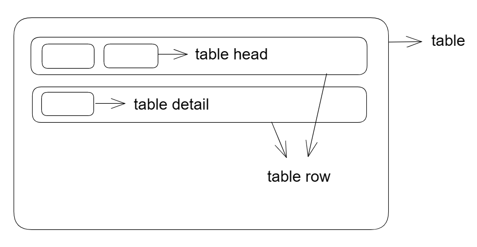
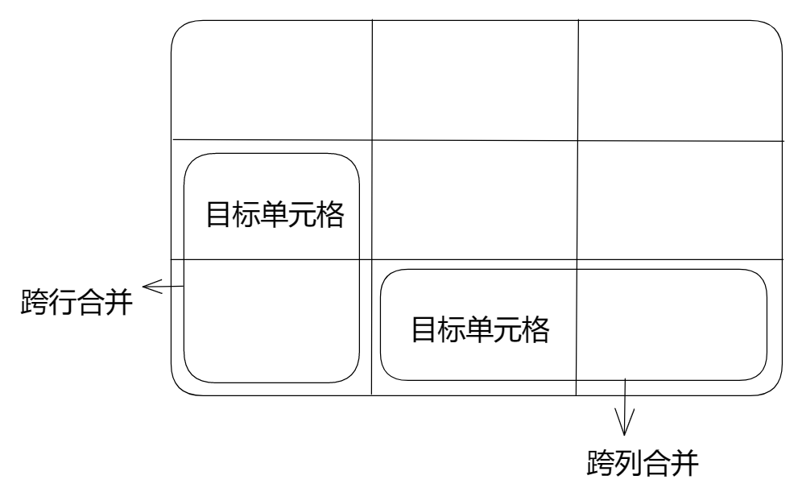
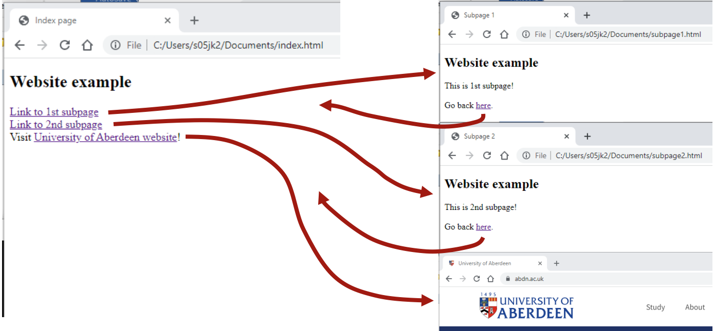

# Git and Codio

在终端

可用git命令查看有哪些git命令

```Terminal
git
```



如何git？

（1）cd **进入需要git的文件所在文件夹**

```Terminal
cd myFile
```

（2）

```Terminal
git init
```

（3）git add **文件名**

```Terminal
git add myFile
```

（4）git commit -m '**备注名**'

```Terminal
git commit -m'firstCommit'
```

存入Github

（5）创建新的分支：一次新的修改

```Terminal
git branch -M main
```

（6）git remote add origin **Github地址**（上传到哪？）

```Terminal
git remote add origin gitagithub.com:StevenLiang36/web-Applcation-Development-.git
```

（7）确认将新修改push进Github

```Terminal
git push -u origin main
```

如果原始文件有修改，需要上传到Github，则只需要从**第（3）步**开始

# HTML

## Introduction

What is HTML?

HTML is **Hypertext Markup Language.**

HTML是一款超文本标记语言，并不是像Java、python那样的编程语言。

所谓**超文本**，就是可以通过相互连接的链接(超链接)交叉引用到其他文本(文档)的文本。**标记**用来定义如何显示页面的文本。

## HTML basics and common tags

### Basic HTML document structure

HTML文档是由**文本内容**和**定义格式的标签**组成的文本文档。

- DOCTYPE

	文本类型

	```html
	<!DOCTYPE html>  <------
	
	<html lang="en">
	<head>
		<meta charset="utf8">
		<title>Basic structure</title>
	</head>
	<body>
		<h1>Basic HTML</h1>
		<p>Some text in a paragraph.</p>
	</body>
	</html>
	```

	所有页面都以DOCTYPE的声明开始。它不是真正的HTML标签。**用于通知浏览器要显示的文档类型。**

- HTML

	```html
	<!DOCTYPE html>  
	
	<html lang="en">   <------
	<head>
		<meta charset="utf8">
		<title>Basic structure</title>
	</head>
	<body>
		<h1>Basic HTML</h1>
		<p>Some text in a paragraph.</p>
	</body>
	</html>   <------
	```

	HTML tag defines the root of the  document.

	所有其他的标签都需要写在<html></html>这两个标签之间。

	其中参数lang用来定义文档的语言，此处“en”代表英语

- head

	```html
	<!DOCTYPE html>  
	
	<html lang="en">   
	<head>   <------
		<meta charset="utf8">
		<title>Basic structure</title>
	</head>   <------
	<body>
		<h1>Basic HTML</h1>
		<p>Some text in a paragraph.</p>
	</body>
	</html>  
	```

	Head tag defines a section with information about the document.

	头标记定义了一个包含文档信息的部分。

	说白了就是文档信息都写在这

- meta

	```html
	<!DOCTYPE html>  
	
	<html lang="en">   
	<head> 
		<meta charset="utf8">   <------
		<title>Basic structure</title>
	</head>   
	<body>
		<h1>Basic HTML</h1>
		<p>Some text in a paragraph.</p>
	</body>
	</html>  
	```

	charset是<meta>标记的属性，其中它的值utf8是指定页面字符的编码

- title

	```html
	<!DOCTYPE html>  
	
	<html lang="en">   
	<head> 
		<meta charset="utf8">
		<title>Basic structure</title>   <------
	</head>   
	<body>
		<h1>Basic HTML</h1>
		<p>Some text in a paragraph.</p>
	</body>
	</html> 
	```

	写文章标题的地方。

	should contain only text.

	只能写文本

- body

	```html
	<!DOCTYPE html>  
	
	<html lang="en">   
	<head> 
		<meta charset="utf8">
		<title>Basic structure</title>   
	</head>   
	<body>   <------
		<h1>Basic HTML</h1>
		<p>Some text in a paragraph.</p>
	</body>   <------
	</html> 
	```

	HTML的主体部分（HTML写这里）

- content

	```html
	<!DOCTYPE html>  
	
	<html lang="en">   
	<head> 
		<meta charset="utf8">
		<title>Basic structure</title>   
	</head>   
	<body>   
		<h1>Basic HTML</h1>   <------
		<p>Some text in a paragraph.</p>   <------
	</body>  
	</html> 
	```

	写其他标签以组成网页内容的地方

### Common tags 

常见的标签

#### headings

标题

```html
...
<body>
<h1>Header level 1</h1>
<h2>Header level 2</h2>
<h3>Header level 3</h3>
<h4>Header level 4</h4>
<h5>Header level 5</h5>
<h6>Header level 6</h6>
</body>
...
```

#### paragraphs and line breaks

段落和行分隔符

```html
...
<body>
<p>This is the first paragraph of 
this HTML document. </p>
    
<p>This is also a paragraph.<br>
Unlike in the first paragraph, here 
we use line breaks. </p>
</body>
...
```

效果：

```
This is the first paragraph of this HTML document.

This is also a paragraph.
Unlike in the first paragraph, here we use line breaks.
```

段落标签：<p></p>

行分隔标签（换行标签）：<br>

#### ordered and unordered lists

有序和无序列表

```html
...
<h2>Ordered list</h2>
<ol>
<li>First in list</li>
<li>Second in list</li>
<li>Third in list</li>
</ol>
<h2>Unordered list</h1>
<ul>
<li>First in list</li>
<li>Second in list</li>
<li>Third in list</li>
</ul>
...
```

效果：



列表分类：

1. 有序列表：<ol></ol>

	ol是order list的缩写

2. 无序列表：<ul></ul>

	ul是unorder list的缩写
	
	无序列表各个列表项之间没有顺序级别之分
	
	其中<ul></ul>中只能嵌套<li></li>
	
	无序列表会带有自己的样式属性，但在实际使用时，我们会使用CSS来设置。

3. 自定义列表（其实就是描述列表）

#### description lists

描述列表

用于对术语或名词进行解释和描述。

```html
...
<h2>Description list</h2>
<dl>
<dt>Coffee</dt>
<dd>Dark hot drink</dd>
<dt>Tea</dt>
<dd>Transparent hot drink</dd>
<dt>Orange juice</dt>
<dd>Orange cold drink</dd>
</dl>
...
```

效果：



描述列表标签：<dl></dl>

描述标题标签（description title）：<dt></dt>

描述细节标签（description details）：<dd></dd>

其中<dl></dl>里面只能包含<dt></dt>和<dd></dd>

#### emphasis

强调

```html
...
<body>
<h2>Emphasis</h2>
<em>I wish to emphasize this 
text.</em>
<br>
<strong>A strongly emphasized 
text.</strong>
</body>
...
```

效果：



斜体：<em></em> 或 <i></i>

加粗：<strong></strong> 或 <b></b>

加粗和斜体皆为**文本格式化标签**，除此之外还有**删除线**和**下划线**：

删除线：<del></del> 或 <s></s>

下划线：<ins></ins> 或 <u></u>

#### quotes

引用

```html
...
<body>
<h2>Quotes</h2>
Hamlet:<blockquote>
"To be or not to be?"</blockquote>
</body>
...
```

效果：



引用：<blockquote></blockquote>

#### tables

表格

##### 表格的基本语法与结构

表格的一般结构为：表头+表身

例：

```html
...
<h2>Tables</h2>
<table>
<tr>
	<th>Name</th>
	<th>Year of Birth</th>
	<th>Home town</th>
</tr>
<tr>
	<td>John Smith</td>
	<td>1967</td>
	<td>Aberdeen</td>
</tr>
<tr>
	<td>James Bond</td>
	<td>1953</td>
	<td>London</td>
</tr>
</table>
...
```

效果：



表格标签：<table></table>

表格中的行（table row）：<tr></tr>（必须嵌套在<table></table>中）

表头（table head）：<th></th>（必须嵌套在<tr></tr>中）

表格内容（table detail）：<td></td>（必须嵌套在<tr></tr>中）



##### 表格的属性

（通常通过CSS来设置）

| 属性名      | 属性                | 描述                                                         |
| ----------- | ------------------- | ------------------------------------------------------------ |
| align       | left, center, right | 规定表格相对周围元素的对齐方式                               |
| border      | 1或“ ”              | 规定表格单元是否拥有边框，默认为“ ”                          |
| cellpadding | 像素值              | 字与单元格边框的距离。规定单元边框与其内容之间的空白。默认为1像素 |
| cellspacing | 像素值              | 单元格之间的空白距离。规定单元格之间的空白。默认为2像素      |
| width       | 像素值或百分比      | 规定表格宽度                                                 |

属性需要写道表格标签<table>里面去

例：

```html
<table align="center" border="1">
```

表格居中+边框

##### 合并单元格

在特殊情况下，需要把多个单元格合并为一个单元格

合并单元格的方式：

1. 跨行合并

	最上侧单元格为目标单元格，写合并代码

	rowspan=“合并单元格的个数”

2. 跨列合并

	最左侧单元格为目标单元格，写合并代码

	colspan=“合并单元格的个数”



合并单元格的三个步骤

1. 确定跨行合并还是跨列合并

2. 找到目标单元格，写上合并方式=合并单元格数量

	例：

	```html
	<td colspan="2"></td>
	```

3. 删除多余单元格

#### images

图片

```html
...
<body>
<h2>Images</h2>
Local image:<br>

<br>
Image from the net:<br><br>

</body>
...
```

图片的标签为单标签

本地的图片：

```html

```

于url的图片：

```html

```

**src是img标签的必须属性，用于指定图像文件的路径和文件名**

图像标签的其他属性

| 属性   | 属性值 | 说明                                   |
| ------ | ------ | -------------------------------------- |
| alt    | 文本   | 替换文本。图片不能显示时替换显示的文字 |
| title  | 文本   | 提示文本。鼠标放在图像上显示的文字     |
| width  | 像素   | 设置图像的宽度                         |
| height | 像素   | 设置图像的高度                         |
| border | 像素   | 设置图像边框粗细                       |

图像标签可以拥有多个属性，属性与属性之间需要空格隔开

属性采取键值对的形式

宽和高属性一般只修改一个，以此保证图片不会被压扁和拉长（修改一个会等比缩放）

#### video and audio

视频和音频

视频：<video></video>

```html
...
<video width="320" height="240" controls>
	<source src="myvideo.mp4" 
			type="video/mp4">
	Video not supported on your device
</video>
...
```

音频：<audio></audio>

```html
...
<audio controls>
	<source src="music.mp3“
			type="audio/mpeg">
	Audio not supported on your device.
</audio>
...

```

#### links

超链接

```html
...
<body>
<h2>Website example</h2>
<a href="subpage1.html">Link to 
1st subpage</a><br>
<a href="subpage2.html">Link to 
2nd subpage</a><br>
Visit
<a href="http://www.abdn.ac.uk"> 
University of Aberdeen 
website</a>!
</body>
...
```

效果：



1. 外部链接

```html
<a href="跳转目标” target="目标窗口弹出的方式">文本或图像</a>
```

超链接标签的属性：

| 属性   | 说明                                                         |
| ------ | ------------------------------------------------------------ |
| href   | （必须属性）用于指定链接目标的url地址                        |
| target | 用于指定链接的打开方式。其中__self是默认值：当前窗口打开页面；__blank:新窗口打开页面。 |

2. 内部链接

	网站内部链接页面之间的相互链接
	
	例中第一个链接便是内部链接

3. 空链接

	当没有确定的链接目标时
	
	```html
	<a href = "#">空链接</a>
	```

4. 下载链接

	如果href里面的地址是一个文件或者是压缩包，点击则会下载这个文件

5. 网页元素链接

	例：
	
	```html
	<a href="http://www.baidu.com"></a>
	```
	
	用img.jpg这张图片可以链接到百度网站

6. 锚点链接

	可以快速定位网页中的某个位置

#### 小盒子

- 小盒子

	```html
	<div></div>
	```

	division的缩写，表示分割、分区

- 大盒子

	```html
	<span></span>
	```

	跨度、跨距

特点：

一行只能放一个<div>。理解为大盒子

一行可以放多个<span>。理解为小盒子

### HTML comments

HTML的注释

```html
<!--  -->
```

快捷键：Ctrl + /

## HTML forms, semantic elements

### HTML forms

HTML表单

**HTML表单为用户提供了与你的网站交互的方式。**

- 主要用于捕捉用户输入/数据（捕获的数据通常被处理和存储为服务器数据）
- 需要使用action属性告诉服务器如何处理发送的数据
- 一个表单可以包含多个不同的输入类型
- 可以使用属性为每个特定的输入类型指定类型(文本、复选框、按钮等)、id和名称


### Semantic elements


# CSS

